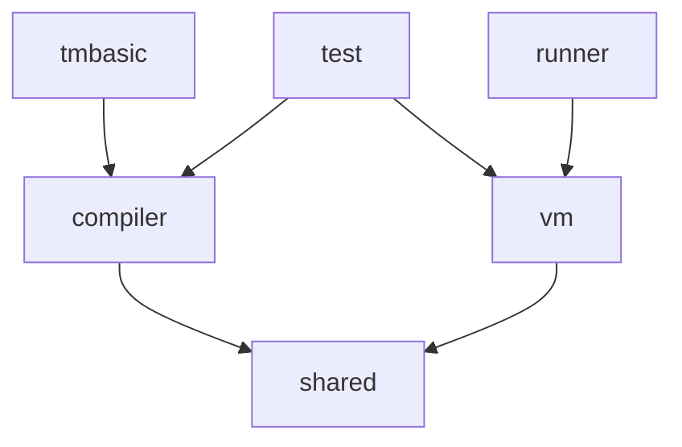

# Contributing to TMBASIC

<!-- update the table of contents with: doctoc --github CONTRIBUTING.md -->
<!-- START doctoc generated TOC please keep comment here to allow auto update -->
<!-- DON'T EDIT THIS SECTION, INSTEAD RE-RUN doctoc TO UPDATE -->
**Table of Contents**

- [Project dependencies](#project-dependencies)
- [Build for Linux and Windows](#build-for-linux-and-windows)
- [Build for macOS](#build-for-macos)
- [Use Visual Studio Code for development and debugging](#use-visual-studio-code-for-development-and-debugging)
- [Take screenshots for the website](#take-screenshots-for-the-website)
- [Update third party dependencies](#update-third-party-dependencies)

<!-- END doctoc generated TOC please keep comment here to allow auto update -->

___

## Project dependencies



## Build from source
TMBASIC is developed using Linux.
It builds for Windows and macOS, too, but you're on your own if you want to develop on those platforms.
Take a look at the GitHub Actions workflows for guidance if you want to try it.

1. Install git and Docker. Give your user account permission to run `docker`.

    ```
    sudo apt-get update -y && \
    sudo apt-get upgrade -y && \
    sudo apt-get install -y git && \
    sudo curl -fsSL https://get.docker.com -o get-docker.sh && \
    sudo sh get-docker.sh && \
    sudo usermod -aG docker $(whoami) && \
    sudo reboot
    ```

1. Clone the git repository.

    ```
    git clone https://github.com/tmbasic/tmbasic.git
    ```

1. Start the build environment and compile TMBASIC.

    ```
    cd tmbasic/build
    ./dev.sh
    scripts/make-tmbasic.sh
    ```

    This will create a development build for Linux suitable for debugging.

1. Type `exit` to leave the build environment.

## Use Visual Studio Code for development and debugging
1. Install the `ms-vscode.cpptools`, `ms-vscode-remote.remote-containers`, and `ms-azuretools.vscode-docker` extensions in Visual Studio Code.
1. Start the container using the instructions above.
1. In Visual Studio Code, click "View" > "Command Palette..." and run the "Remote-Containers: Attach to Running Container..." command. OR: switch to the Docker tab, right-click on the container > "Attach Visual Studio Code".
1. Choose the `/tmbasic-dev` container.
1. Choose the `/code` directory.

If your Docker engine is running on another machine, modify the above steps:
1. Install the `ms-vscode-remote.remote-ssh` extension too.
1. Download the [Docker client EXE](https://github.com/StefanScherer/docker-cli-builder/releases) and stick it somewhere on your `PATH`.
1. Start `dev.sh` on the remote machine.
1. In VSCode, press Ctrl+Shift+P and run the "Remote-SSH: Connect to host..." command to connect to the remote machine.
1. Continue with the original steps.

## Take screenshots for the website
SVG screenshots would have been nice, but they get garbled in some browsers (Chrome on Android). Instead, we will just take regular PNG screenshots.

- Windows 10 at 175% scaling
- PuTTY
- Terminal size: 80x24
- Window > Appearance
    - Cursor appearance: Underline
    - Font: Consolas 14pt
    - Font quality: Antialiased
- Window > Colours > ANSI Cyan: 58, 150, 221

Crop to the console area including the one pixel black outline. Post-process with:

```
pngcrush -brute -reduce -ow screenshot.png
```

## Update third party dependencies

1. In `build/`, run `scripts/depsCheck.sh`. Update `build/scripts/depsDownload.sh`.
1. In `build/`, run `scripts/depsDownload.sh` to pull the latest version of each dep.
1. In `build/downloads/`, `rm sysroot-* ; aws s3 sync . s3://tmbasic-archive/deps/ --size-only --endpoint-url https://367bdafee4af5175025295154f92e84a.r2.cloudflarestorage.com`
1. Commit as "Update deps".
1. Check for new Alpine releases. Search for `alpine:` to find the Dockerfiles to update. Commit as "Update Alpine".
