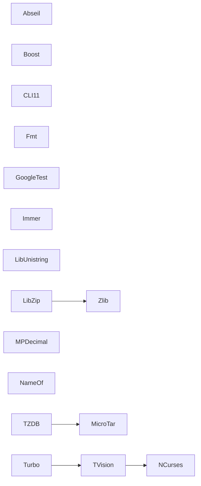

# TMBASIC Dependencies

This document describes the dependency relationships between the various third-party libraries used in TMBASIC.

## Dependency Graph

## Library Descriptions

### Build Tools
Note: Most libraries depend on these core build tools:
- **CMake**: Build system generator
- **Binutils**: GNU Binary Utilities, required for cross-compilation

### Libraries
- **Abseil**: Google's C++ library designed to augment the C++ standard library
- **Boost**: Collection of peer-reviewed portable C++ source libraries
- **CLI11**: Command line parser for C++11 and beyond
- **Fmt**: A modern formatting library
- **GoogleTest**: Google's C++ test framework
- **Immer**: Immutable data structures for C++
- **LibUnistring**: Library for Unicode string manipulation
- **LibZip**: Library for reading, creating, and modifying zip archives (depends on Zlib)
- **MicroTar**: Lightweight tar archive manipulation library
- **MPDecimal**: Library for decimal floating point arithmetic
- **NameOf**: Compile-time name strings for C++
- **NCurses**: Terminal manipulation library
- **Turbo**: Terminal UI framework (depends on TVision)
- **TVision**: Text User Interface library (depends on NCurses)
- **TZDB**: Time Zone Database (depends on MicroTar)
- **Zlib**: Data compression library

## Build Order

The build system follows this general order based on dependencies:

1. CMake and Binutils (build tools)
2. Basic libraries without dependencies:
   - Boost
   - CLI11
   - NameOf
   - NCurses
   - Zlib
   - MicroTar
   - MPDecimal
   - LibUnistring
   - Fmt
   - GoogleTest
   - Immer
   - Abseil
3. Libraries with dependencies:
   - TVision (depends on NCurses)
   - LibZip (depends on Zlib)
   - Turbo (depends on TVision)
   - TZDB (depends on MicroTar)

## Notes

- Most libraries require Binutils for cross-compilation support
- Many libraries use CMake as their build system
- Some libraries are header-only (e.g., CLI11, NameOf, Boost) and don't require compilation
- The build system supports multiple target architectures and operating systems (Linux, Windows, macOS) 